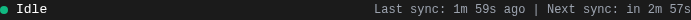

# AdGuard Home Sync - Enhanced Fork

This is an enhanced fork of [bakito/adguardhome-sync](https://github.com/bakito/adguardhome-sync) with additional UI improvements and real-time monitoring features for production homelab environments.

## 🔗 Links
- **Upstream Project**: https://github.com/bakito/adguardhome-sync
- **This Fork**: https://github.com/eddygk/adguardhome-sync
- **Maintainer**: Eddy Kawira - [eddykawira.com](https://eddykawira.com)
- **Production Deployment**: See [docs/IMPLEMENTATION.md](./docs/IMPLEMENTATION.md)

## 📊 Status
- ✅ **Production Ready**: Deployed in homelab environment (October 2025)
- 🔄 **Upstream PR**: Discussion/PR pending with upstream maintainer
- 🛠️ **Actively Maintained**: Regular updates and improvements

## 📸 Screenshots

### Real-time Progress Monitoring


*Live countdown timers update every second, showing time since last sync and time until next scheduled sync*

### System Architecture
<div align="center">


*Simple, efficient design adds monitoring without impacting sync performance*

</div>

### Complete Interface


*Production deployment showing real-time sync logs, progress indicator, and control buttons*

---

## ✨ Additional Features

### 1. Real-time Sync Progress Monitoring
**Implemented**: October 2025

Adds comprehensive sync status visibility with real-time updates.

**Backend Enhancements:**
- New API endpoint: `GET /api/v1/sync-schedule`
- Sync time tracking in worker struct (`lastSyncTime`, `nextSyncTime`, `cronEntryID`)
- Dynamic cron interval calculation (works with any cron expression)
- Response includes: last sync, next sync, running status, cron expression, interval seconds

**Frontend Features:**
- Real-time countdown timers ("Last sync: 2m 30s ago | Next sync: in 2m 30s")
- Visual progress bar (0-100% representing sync cycle progress)
- Animated status indicator (green dot when idle, pulsing blue when syncing)
- Automatic UI updates every 1 second
- API polling every 30 seconds

**Technical Details:**
- Zero external dependencies (uses existing jQuery/Bootstrap)
- Minimal performance impact (1-second UI updates, 30-second API polls)
- Theme-aware styling (automatically adapts to light/dark mode)
- Responsive design (works on all screen sizes)

**Example API Response:**
```json
{
  "lastSyncTime": "2025-10-05T17:07:37.726Z",
  "nextSyncTime": "2025-10-05T17:10:00.000Z",
  "syncRunning": false,
  "cronExpression": "*/5 * * * *",
  "intervalSeconds": 300
}
```

**Modified Files:**
- `internal/sync/sync.go` - Time tracking
- `internal/sync/http.go` - API endpoint
- `internal/sync/static/index.html` - UI implementation

### 2. Dark Mode Toggle
**Implemented**: October 2025

Client-side theme switching with persistent preference storage.

**Features:**
- Toggle button in header (top-right corner)
- Instant theme switching (no page reload)
- Preference saved to browser localStorage
- Icon changes: 🌙 (light mode) ↔️ ☀️ (dark mode)
- Themes: Bootstrap 5.3.3 (light), Bootswatch Darkly 5.3 (dark)

**Modified Files:**
- `internal/sync/static/static.go` - Exposed theme CSS endpoints
- `internal/sync/static/index.html` - Toggle UI and JavaScript

### 3. Layout Stability Fixes
**Implemented**: October 2025

Resolves CSS inconsistencies between Bootstrap light/dark themes.

**Fixes:**
- Normalized h1 typography (prevents button position shifts during theme changes)
- Added scrollbar gutter stability (prevents horizontal layout shifts)
- Consistent header spacing across themes

**CSS Changes:**
```css
html {
    overflow-y: scroll;
    scrollbar-gutter: stable;
}

h1 {
    font-size: 2rem !important;
    line-height: 1.2 !important;
}
```

## 🏠 Use Case: Homelab High-Availability DNS

**Environment:**
- 4-node Proxmox cluster running AdGuard Home instances
- Primary DNS: 10.10.20.6:80
- Replica DNS: 10.10.20.7:80
- Sync Controller: 10.10.20.8:8080
- Sync frequency: Every 5 minutes

**Why These Features Matter:**
- **Visibility**: Instant feedback on sync health without checking logs
- **Monitoring**: API endpoint integrates with monitoring systems
- **Reliability**: Visual confirmation of HA DNS configuration synchronization

## 🚀 Quick Start

**Installation:**
```bash
# Clone this fork
git clone https://github.com/eddygk/adguardhome-sync.git
cd adguardhome-sync

# Build
go build -o adguardhome-sync

# Run
./adguardhome-sync run --config /path/to/config.yaml
```

**Access Web UI:**
```
http://localhost:8080
```

**API Endpoint:**
```bash
# Get sync schedule
curl http://localhost:8080/api/v1/sync-schedule

# Trigger manual sync
curl -X POST http://localhost:8080/api/v1/sync
```

## 📖 Documentation

- **Production Deployment**: [docs/IMPLEMENTATION.md](./docs/IMPLEMENTATION.md)
- **Development Guide**: [CLAUDE.md](./CLAUDE.md)
- **Implementation Plan**: [SYNC_PROGRESS_PLAN.md](./SYNC_PROGRESS_PLAN.md)
- **Upstream README**: [README.md](./README.md)

## 🤝 Contributing to Upstream

These features are being considered for upstream contribution. If you find them useful, please:
1. Star this fork
2. Comment on the upstream discussion (link TBD)
3. Share your use case

## 📜 License

This project maintains the original Apache License 2.0.

**Original Work**: Copyright 2021 bakito
**Modifications**: Copyright 2025 Eddy Kawira

Licensed under the Apache License, Version 2.0 (the "License");
you may not use this file except in compliance with the License.
You may obtain a copy of the License at

    http://www.apache.org/licenses/LICENSE-2.0

Unless required by applicable law or agreed to in writing, software
distributed under the License is distributed on an "AS IS" BASIS,
WITHOUT WARRANTIES OR CONDITIONS OF ANY KIND, either express or implied.
See the License for the specific language governing permissions and
limitations under the License.

## 🙏 Acknowledgments

- **bakito** - Original AdGuard Home Sync project
- **AdGuard Team** - AdGuard Home DNS software
- **Homelab Community** - Inspiration and use cases

---

**Maintained by**: Eddy Kawira | [eddykawira.com](https://eddykawira.com) | [GitHub](https://github.com/eddygk)
